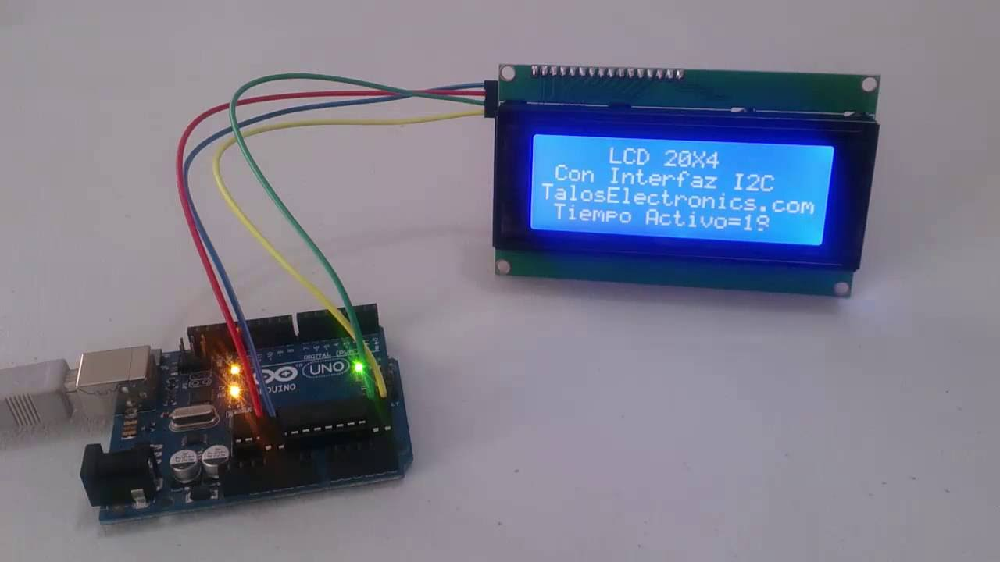
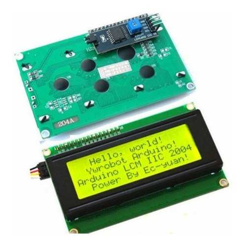

#### Hecho por: Jairo Jaziel Perez Rojas
#### LCD 20x4
La pantalla LCD 20x4 (conocido también como display LCD 20x4) es un dispositivo que permite la presentación de caracteres alfanuméricos y otros simbolos en un formato de 20 caracteres por línea, en 4 líneas

#### Caracteristicas

| **Sensor LCD**                 | **Caracteristicas**          |
|----------------------------|---------------------------|
| Modelo                     | 20X04                    |
| Formato                    | 20 Caracte.x 4 Lineas     |
| Interfaz                   | 4 Bits/8Bits              |
| caracteres                 | 5x8 puntos                |
| Controlador                | SPLC780                   |
| Temperatura fundicion      | 5-10 a +60 grados Celsius |
| Temperatura almacenamiento | -20 a +70 grados Celsius  |
| Voltaje de funcionamiento  | 5V                        |
| Consumo de luz fondo       | 40 mA                     |
#### LCD 20x4 con 12C
Display LCD de 4 líneas de 20 caracteres con comunicaciones I2C y serie y retro iluminación controlable por software. Gracias a su iluminación posterior, los mensajes se ven claramente incluso en total oscuridad.

#### Caracteristicas
- Pantalla – 20 caracteres por línea, 4 líneas
- Alimentación – 5v
- Consumo – 125mA con retroiluminación de pantalla encendida
- Comunicaciones – I2C o serie 9600bps
- Teclado – Escaneo automático de teclado matricial 3×4
- Caracteres personalizados – hasta 8 caracteres personalizados fácilmente definidos
- Retroiluminación de pantalla apagada por defecto, puede ser encendida por software.
= Disponible en dos colores de pantalla: Texto negro sobre fondo verde (clásico) y texto blanco sobre fondo azul

